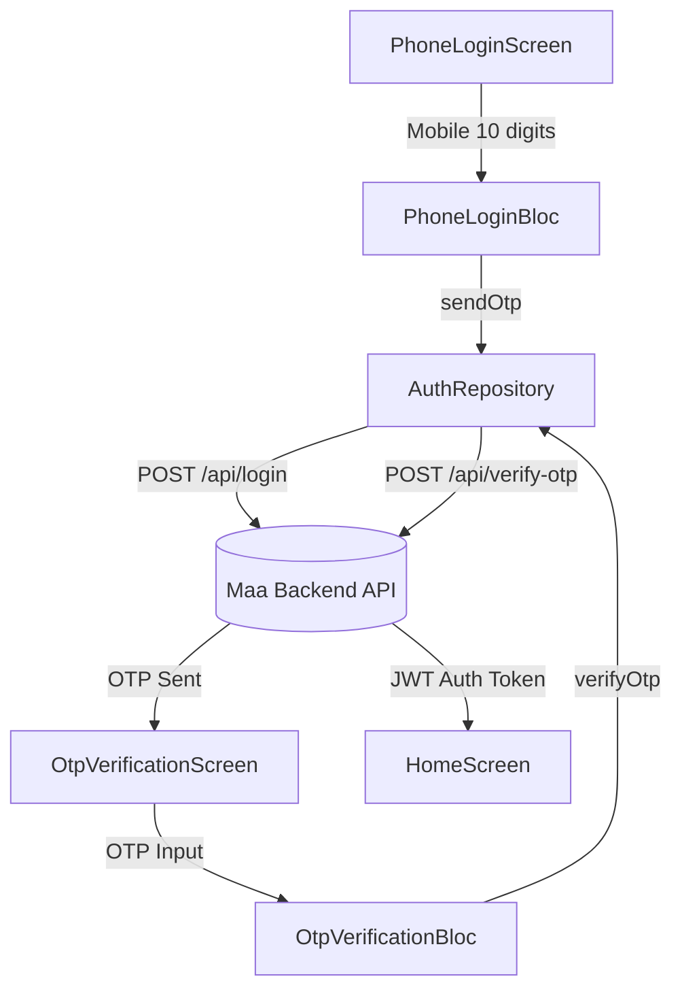

# Auth Feature

The Auth feature manages mobile OTP-based authentication for the Maa Stitch Viewer application. It allows users to enter a 10-digit mobile number, receive a 4-digit verification code via REST API, and verify the OTP to access the application.

## What lives here

- **PhoneLoginScreen**: Entry screen for mobile number input and OTP request.
- **OtpVerificationScreen**: OTP verification screen with resend timer and custom 4-digit input.
- **PhoneLoginBloc**: Manages state for mobile input validation and OTP dispatch.
- **OtpVerificationBloc**: Manages state for OTP input, validation, resend timer, and verification.
- **AuthRepository**: Interface for authenticating with the Maa Embroidery backend APIs.

## Files

- `lib/features/auth/domain/repositories/auth_repository.dart`
- `lib/features/auth/data/repositories/auth_repository_impl.dart`
- `lib/features/auth/presentation/bloc/phone_login/phone_login_bloc.dart`
- `lib/features/auth/presentation/bloc/otp_verification/otp_verification_bloc.dart`
- `lib/features/auth/presentation/screens/phone_login_screen.dart`
- `lib/features/auth/presentation/screens/otp_verification_screen.dart`
- `lib/features/auth/presentation/widgets/phone_input_field_widget.dart`
- `lib/features/auth/presentation/widgets/otp_pin_input_widget.dart`

## Flow chart

### User & Data Flow (ASCII)

```
┌──────────────────┐
│ PhoneLoginScreen │
└────────┬─────────┘
         │ (Mobile Input)
         ▼
┌──────────────────┐
│  PhoneLoginBloc  │
└────────┬─────────┘
         │ (sendOtp)
         ▼
┌──────────────────┐      POST /api/login      ┌──────────────────────────┐
│  AuthRepository  │ ────────────────────────> │  Maa Embroidery Backend  │
└────────┬─────────┘ (app_source: stitch)      └──────────────────────────┘
         │ (Success)
         ▼
┌───────────────────────┐
│ OtpVerificationScreen │
└────────┬──────────────┘
         │ (4-Digit OTP)
         ▼
┌───────────────────────┐
│ OtpVerificationBloc   │
└────────┬──────────────┘
         │ (verifyOtp)
         ▼
┌──────────────────┐    POST /api/verify-otp   ┌──────────────────────────┐
│  AuthRepository  │ ────────────────────────> │  Maa Embroidery Backend  │
└────────┬─────────┘ (app_source: stitch)      └──────────────────────────┘
         │ (Success - JWT Token)
         ▼
┌──────────────────┐
│    HomeScreen    │
└──────────────────┘
```

### Flow Chart (Mermaid)


