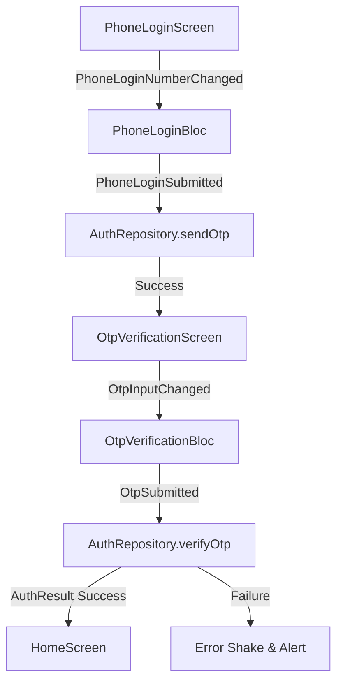

# Phone Authentication & OTP Verification Feature

This feature handles user authentication via mobile phone number entry with country selection and 4-digit OTP verification using `pinput`. It features real-time phone validation, interactive resend timer, error shake animations, Hero transitions, and shimmer skeleton loading states.

## What lives here

- `PhoneLoginScreen` — Phone entry screen with country code picker and format validation.
- `OtpVerificationScreen` — 4-digit pin entry screen powered by `Pinput` with resend countdown timer.
- `PhoneLoginBloc` & `OtpVerificationBloc` — BLoC state management for input handling and verification flow.
- `AuthRepository` & `AuthRepositoryImpl` — Clean architecture domain interface and data provider.

## Files

- `lib/features/auth/auth.dart` — Feature barrel export.
- `lib/features/auth/domain/` — `AuthRepository`, `CountryCodeModel`, `AuthResultModel`.
- `lib/features/auth/data/` — `AuthRepositoryImpl`.
- `lib/features/auth/presentation/bloc/` — `PhoneLoginBloc`, `OtpVerificationBloc`.
- `lib/features/auth/presentation/screens/` — `PhoneLoginScreen`, `OtpVerificationScreen`.
- `lib/features/auth/presentation/widgets/` — `PhoneInputFieldWidget`, `OtpPinInputWidget`, `OtpTimerResendWidget`, `PhoneLoginShimmerWidget`, `OtpVerificationShimmerWidget`, etc.

## Flow chart

### User & Data Flow (ASCII)

```
┌────────────────────┐
│ PhoneLoginScreen   │
└─────────┬──────────┘
          │ (Submit 10-digit number)
          ▼
┌────────────────────┐      (Success)      ┌─────────────────────────┐
│  PhoneLoginBloc    ├────────────────────►│ OtpVerificationScreen   │
└────────────────────┘                     └────────────┬────────────┘
                                                        │ (Submit 4-digit OTP)
                                                        ▼
                                           ┌─────────────────────────┐
                                           │ OtpVerificationBloc     │
                                           └────────────┬────────────┘
                                                        │ (Auth Token)
                                                        ▼
                                           ┌─────────────────────────┐
                                           │ HomeScreen (Main App)   │
                                           └─────────────────────────┘
```

### Flow Chart (Mermaid)


