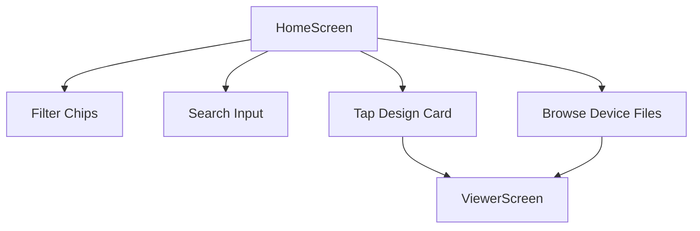

# Home Feature

Main dashboard listing recent and sample embroidery design files (`.dst`, `.emb`, `.dhp`), format filter chips, search input, and device file picker trigger.

## What lives here
- `HomeScreen`: Dashboard UI showing design cards, format filters, and search bar.
- `HomeBloc`: BLoC managing file loading, filtering, search, and file picker invocation.
- `HomeRepository`: Abstract contract for fetching sample and user embroidery files.

## Files
- `lib/features/home/home.dart`
- `lib/features/home/presentation/screens/home_screen.dart`
- `lib/features/home/presentation/bloc/home_bloc.dart`
- `lib/features/home/presentation/widgets/home_header_widget.dart`
- `lib/features/home/presentation/widgets/file_import_card_widget.dart`
- `lib/features/home/presentation/widgets/format_filter_chips_widget.dart`
- `lib/features/home/presentation/widgets/design_card_widget.dart`
- `lib/features/home/presentation/widgets/design_details_sheet_widget.dart`
- `lib/features/home/presentation/widgets/empty_state_widget.dart`

## Flow chart

```
┌──────────────┐
│ HomeScreen   │
└──────┬───────┘
       │
       ├─────────────────► Filter by Format (.dst, .emb, .dhp)
       ├─────────────────► Search by Name/Extension
       ├─────────────────► Pick Device File
       │
       ▼ Tap Card / File
┌──────────────┐
│ ViewerScreen │
└──────────────┘
```

### Mermaid


