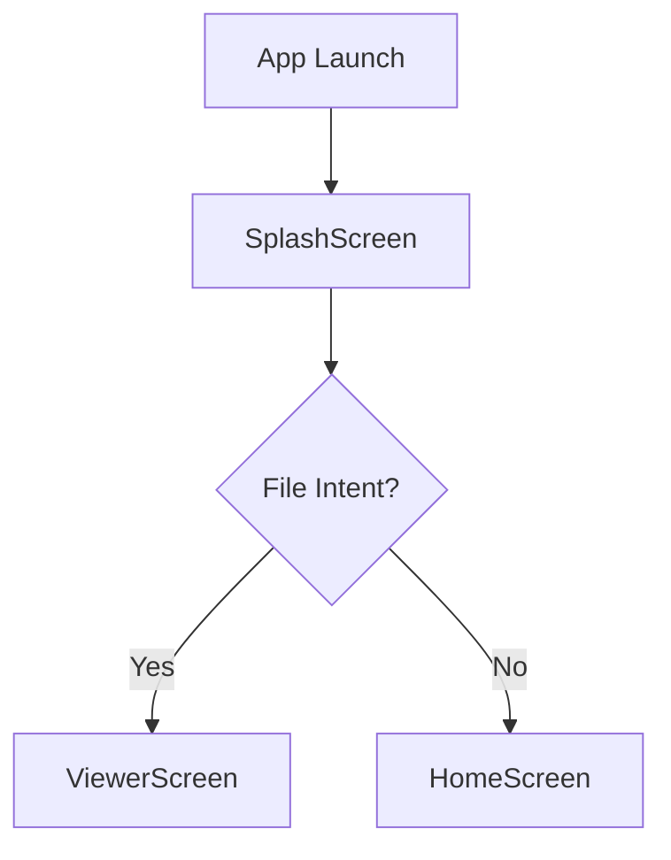

# Splash Feature

Initial entrance feature that handles offline splash logo animation, initializes dependencies, and checks for cold-start Android file intent opening (`.dst`, `.emb`, `.dhp`).

## What lives here
- `SplashScreen`: Main screen widget with logo entrance animation.
- `SplashBloc`: Manages initial splash state and intent verification.
- `SplashRepository`: Abstraction for initial intent check.

## Files
- `lib/features/splash/splash.dart`
- `lib/features/splash/presentation/screens/splash_screen.dart`
- `lib/features/splash/presentation/bloc/splash_bloc.dart`
- `lib/features/splash/presentation/widgets/splash_logo_widget.dart`
- `lib/features/splash/presentation/widgets/splash_offline_badge_widget.dart`

## Flow chart

```
[ App Launch ]
      │
      ▼
┌──────────────┐      File Opened?      ┌────────────────┐
│ SplashScreen │ ─────────────────────► │ ViewerScreen   │
└──────────────┘       (Intent)         └────────────────┘
      │                                 
      │ No File                         
      ▼                                 
┌──────────────┐                        
│ HomeScreen   │                        
└──────────────┘                        
```

### Mermaid


