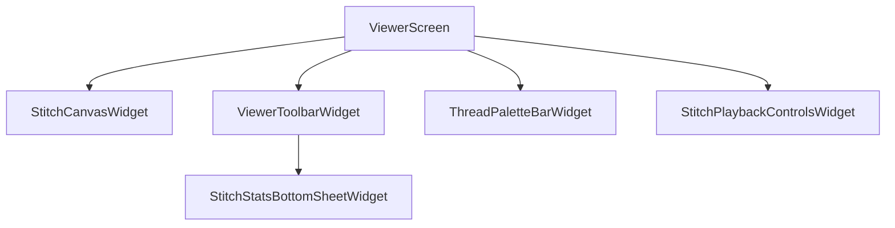

# Viewer Feature

Interactive embroidery design viewer feature with pan, pinch-zoom, custom stitch painter canvas, thread layer color selector, grid toggle, jump line toggle, and step-by-step playback simulation.

## What lives here
- `ViewerScreen`: Screen wrapper initializing `ViewerBloc` and holding interactive canvas controls.
- `ViewerBloc`: BLoC managing zoom reset, thread selection, jump lines toggle, grid toggle, and playback animation.
- `StitchCanvasWidget`: Custom painter rendering stitch points, thread paths, origin, and grid overlay.
- `ViewerToolbarWidget`: Top app bar overlay with format details and control toggles.
- `ThreadPaletteBarWidget`: Bottom thread palette strip for layer selection.
- `StitchPlaybackControlsWidget`: Step-by-step playback simulation bar with speed selector.
- `StitchStatsBottomSheetWidget`: Detailed stitch count, thread length, and dimension statistics.

## Files
- `lib/features/viewer/viewer.dart`
- `lib/features/viewer/presentation/screens/viewer_screen.dart`
- `lib/features/viewer/presentation/bloc/viewer_bloc.dart`
- `lib/features/viewer/presentation/widgets/stitch_canvas_widget.dart`
- `lib/features/viewer/presentation/widgets/viewer_toolbar_widget.dart`
- `lib/features/viewer/presentation/widgets/thread_palette_bar_widget.dart`
- `lib/features/viewer/presentation/widgets/stitch_playback_controls_widget.dart`
- `lib/features/viewer/presentation/widgets/stitch_stats_bottom_sheet_widget.dart`

## Flow chart

```
┌────────────────┐
│ ViewerScreen   │
└───────┬────────┘
        │
        ├─────────────────► StitchCanvasWidget (InteractiveViewer + CustomPainter)
        ├─────────────────► ViewerToolbarWidget (Grid / Jump / Points Toggles)
        ├─────────────────► ThreadPaletteBarWidget (Thread Layer Selection)
        └─────────────────► StitchPlaybackControlsWidget (Playback Simulation)
```

### Mermaid


